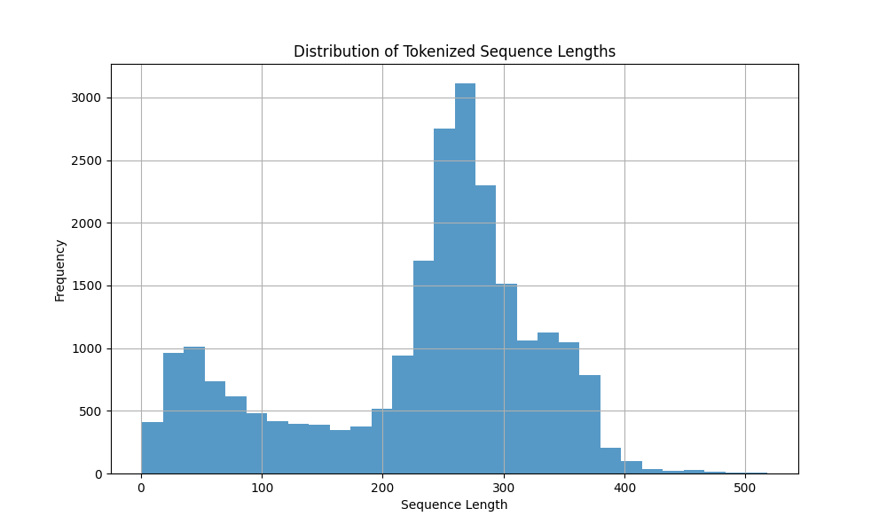
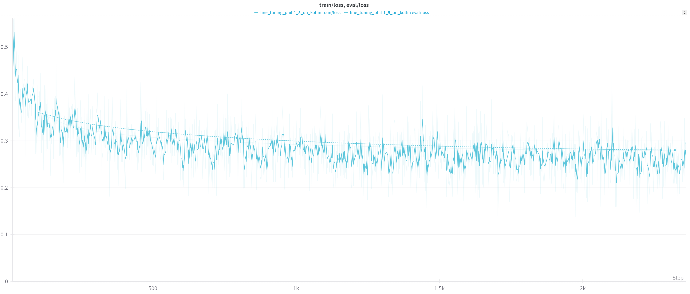

# Kotlin Dataset

I used the [Kotlin repository](https://github.com/JetBrains/kotlin) to create a dataset for a code completion task.

The code for generating the dataset can be found in [src/dataset/generate_kotlin_dataset.py](src/dataset/generate_kotlin_dataset.py).

All files were divided into three parts: training, validation, and testing. The training and validation datasets were created by splitting each file into code blocks, each no longer than 1000 characters.

The length distribution of code blocks in the training dataset after tokenization is as follows:

 [](images/length_distribution_histogram.png)

The test dataset was created differently. All function definitions were extracted from the files, and each function was transformed into a test case by adding all the code before this function and the function signature to the context and the function body to the code that should be completed.

Here are the characteristics of the dataset:

| Dataset     | Size  |
|-------------|-------|
| Train       | 23383 |
| Validation  | 2625  |
| Test        | 435   |

# Fine-tuning the Model

The model was fine-tuned on the Kotlin dataset. The fine-tuning code can be found in [src/fine_tuning/fine_tune.py](src/fine_tuning/fine_tune.py). The PEFT technique LoRA was used with the following configuration:
```angular2html
LoraConfig(
    r=8,
    lora_alpha=16,
    target_modules=[
        "q_proj",
        "k_proj",
        "v_proj",
        "dense",
        "fc1",
        "fc2",
        "lm_head"
    ],
    bias="none",
    lora_dropout=0.05, 
    task_type="CAUSAL_LM",
)
```

The number of parameters for fine-tuning:

```
trainable params: 7503872 || all params: 1425774592 || trainable%: 0.53
```

The batch size was set to 1 as I only had access to a single V100 GPU.

The total number of steps was 23383 (one epoch).

Train and validation losses (logged every 10 steps) can be seen here:

[](images/train_val_loss.png)

# Metrics

The scripts for evaluating the model can be found in the [src/evaluation/](src/evaluation/) folder.

In order to test the model performance for python, [microsoft codexglue method generation dataset](https://huggingface.co/datasets/microsoft/codexglue_method_generation) was used
(test part with 20000 test cases).

The metrics before fine-tuning are as follows:

| Dataset            | exact_match | edit_sim |
|--------------------|-------------|----------|
| Python (codeXglue) | 0.007       | 0.18     |
| Kotlin             | 0.015       | 0.30     |

The metrics after fine-tuning are:

| Dataset            | exact_match | edit_sim |
|--------------------|-------------|----------|
| Python (codeXglue) | 0.002       | 0.07     |
| Kotlin             | 0.029       | 0.38     |

# Analysis

Fine-tuning the model on the Kotlin dataset improved the model's performance 
in the task of Kotlin code completion. After fine-tuning, the model was able to
write meaningful Kotlin code snippets. Here are few examples of generated and expected code snippets:

Generated code:
```kotlin
    val changedSymbols = allChangedSymbols.toSet()
    for (file in filesDiff) {
        val changedSymbol = file.symbol
        if (changedSymbol!= null) {
            changedSymbols.add(changedSymbol)
        }
    }
    return ChangesEither(changedSymbols)
}
```

Expected:
```kotlin

    val modifiedJava = filesDiff.modified.filter(File::isJavaFile)
    val removedJava = filesDiff.removed.filter(File::isJavaFile)

    if (removedJava.any()) {
        reporter.info { "Some java files are removed: [${removedJava.joinToString()}]" }
        return ChangesEither.Unknown(BuildAttribute.JAVA_CHANGE_UNTRACKED_FILE_IS_REMOVED)
    }

    val symbols = HashSet<LookupSymbol>()
    for (javaFile in modifiedJava) {
        assert(javaFile.extension.equals("java", ignoreCase = true))

        val psiFile = psiFileFactory(javaFile)
        if (psiFile !is PsiJavaFile) {
            reporter.info { "Expected PsiJavaFile, got ${psiFile?.javaClass}" }
            return ChangesEither.Unknown(BuildAttribute.JAVA_CHANGE_UNEXPECTED_PSI)
        }

        psiFile.classes.forEach { it.addLookupSymbols(symbols) }
    }
    allSymbols.addAll(symbols)
    return ChangesEither.Known(lookupSymbols = symbols)
}
```

Generated code:
```kotlin
    caret_context>context()
}
```

Expected:
```kotlin
    class Local {}

    <caret_context>Local()
}
```

Generated code:
```kotlin
    foo()
}
```

Expected:
```kotlin
    val s = foo()
    s.length
}
```


Generated code:
```kotlin
    return if (a > b) a else b
}
```

Expected:
```kotlin
    if (a > b) {
        println(a)
        return a
    } else {
        println(b)
        return b
    }
}
```


After fine-tuning the model on the Kotlin dataset, the performance of the model improved on the Kotlin dataset, but declined on the Python dataset. Sometimes, the model began generating Kotlin code when trying to complete Python code. For example, the model generated the following code when given the Python dataset:

`init {  }`

Expected: 

```raw_result = self._retarget_initial( resource_group_name=resource_group_name, ...```

In a number of cases, the fine-tuned model did not generate any code at all on the Python dataset.

To improve the baseline model's performance on the Kotlin dataset without losing performance on the Python dataset, 
I believe it is necessary to fine-tune it on a mixture of Kotlin and Python datasets.